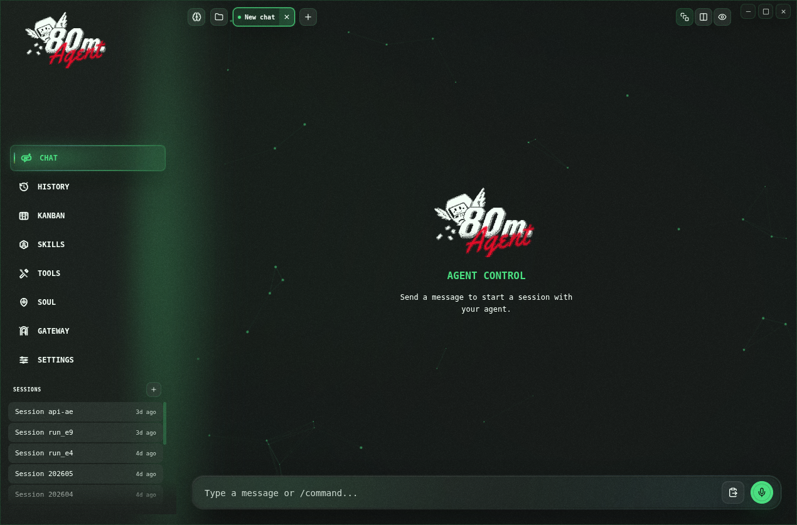
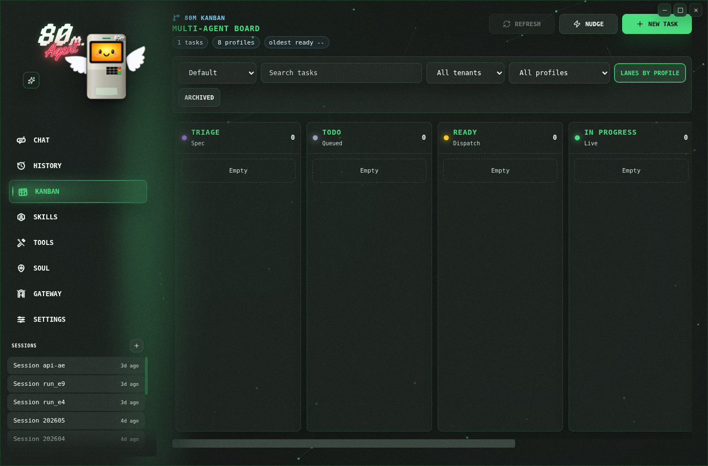
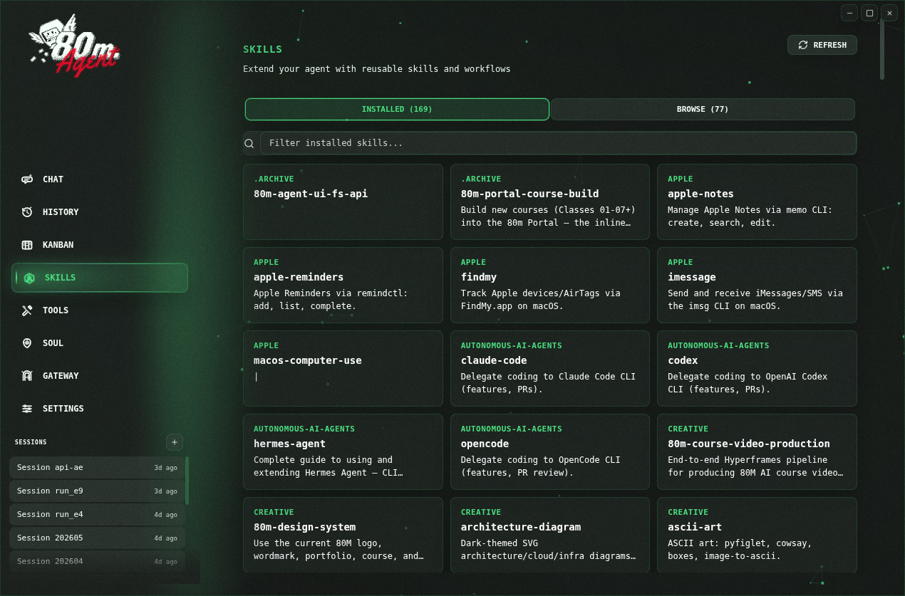
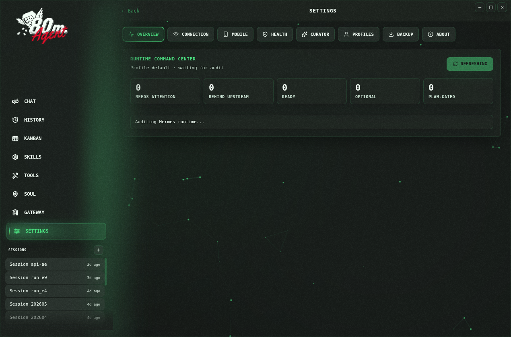
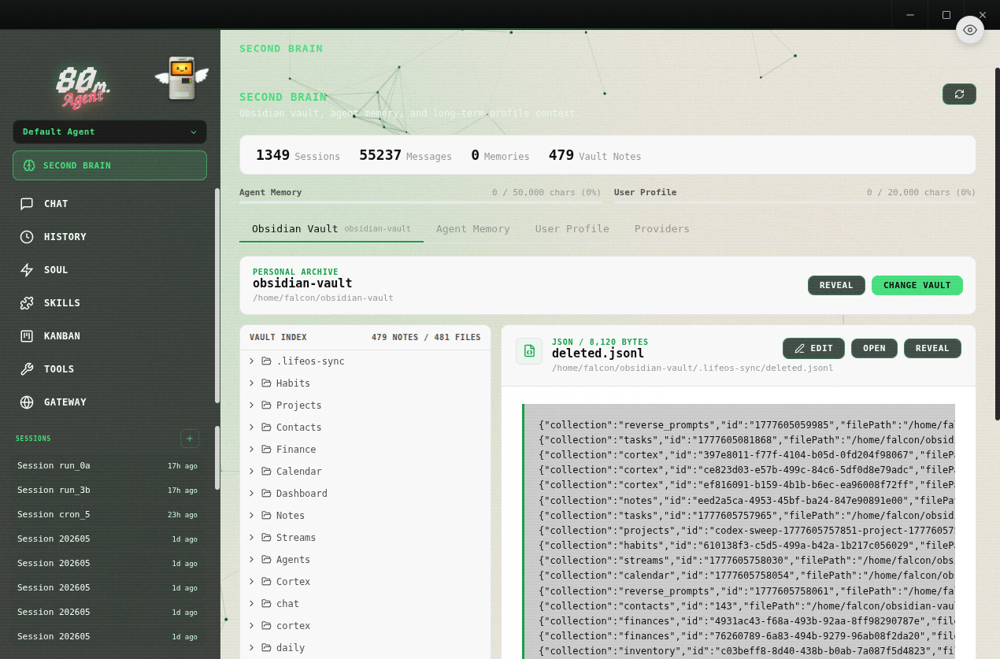
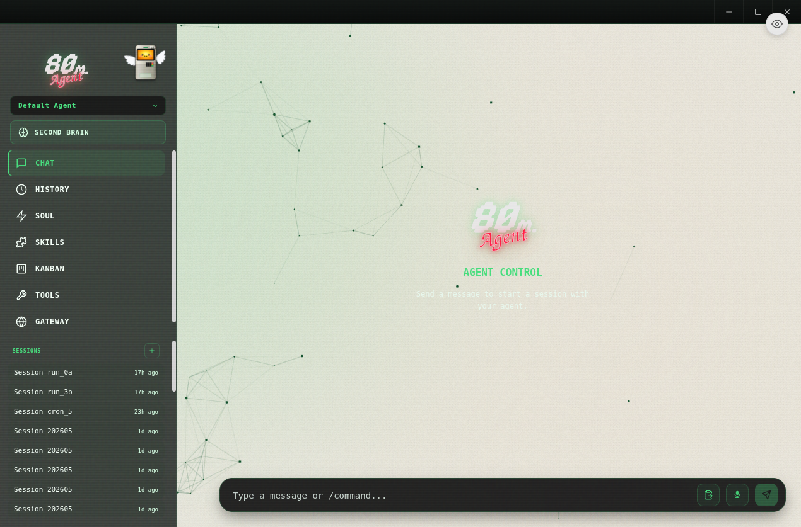

<br/>
<p align="center">
  <a href="https://github.com/guapdad4000/80m-agent-desktop-v3/releases/"></a>
  <a href="https://github.com/guapdad4000/80m-agent-desktop-v3/blob/main/LICENSE"></a>
</p>

> **80M Agent Desktop** is the native desktop command center for your local 80M AI workspace: chat, profiles, memory, tools, schedules, Kanban, and gateway automations in one branded app. Download the latest release for macOS, Linux, or Windows below.

## Languages

- English: `README.md`
- 简体中文: `README.zh-CN.md`

## Install

Download the latest build from the [Releases](https://github.com/guapdad4000/80m-agent-desktop-v3/releases/) page.

| Platform | File                  |
| -------- | --------------------- |
| Windows  | `.exe`                |
| macOS    | `.dmg`                |
| Linux    | `.AppImage` or `.deb` |

> **macOS users:** The app is not code-signed or notarized. macOS will block it on first launch. To fix this, run the following after installing:
>
> ```bash
> xattr -cr "/Applications/80m Agent Desktop.app"
> ```
>
> Or right-click the app → **Open** → click **Open** in the confirmation dialog.

## What You Get

- **Guided first-run install** for the local 80M runtime with progress tracking and dependency resolution
- **Multi-provider support** — OpenRouter, Anthropic, OpenAI, Google (Gemini), xAI (Grok), Qwen, MiniMax, Hugging Face, Groq, and local OpenAI-compatible endpoints (LM Studio, Ollama, vLLM, llama.cpp)
- **Streaming chat UI** with SSE streaming, tool progress indicators, markdown rendering, and syntax highlighting
- **Token usage tracking** — live prompt/completion token counts and cost display in the chat footer
- **Session management** — full-text search (SQLite FTS5), date-grouped history, resume and search across conversations
- **Profile switching** — create, delete, and switch between separate 80M environments with isolated config
- **14 toolsets** — web, browser, terminal, file, code execution, vision, image gen, TTS, skills, memory, session search, delegation, MoA, and task planning
- **Memory system** — view/edit memory entries, user profile memory, capacity tracking, and discoverable memory providers
- **Persona editor** — edit and reset your agent's SOUL.md personality
- **Saved models** — CRUD management for model configurations across providers
- **Scheduled tasks** — cron job builder with 15 delivery targets
- **Kanban board** — multi-agent task board with profiles, comments, run history, dispatcher nudges, and attached research notes
- **16 messaging gateways** — Telegram, Discord, Slack, WhatsApp, Signal, Matrix, Mattermost, Email (IMAP/SMTP), SMS, iMessage, DingTalk, Feishu/Lark, WeCom, WeChat, Webhooks, Home Assistant
- **Backup & import** — full data backup/restore from Settings
- **Auto-updater** — check for and install updates automatically
- **i18n ready** — internationalization framework with English and Simplified Chinese locales

## Preview

<table>
<tr>
<td width="50%" align="center"><b>Chat</b><br/></td>
<td width="50%" align="center"><b>Kanban</b><br/></td>
</tr>
<tr>
<td width="50%" align="center"><b>Skills</b><br/></td>
<td width="50%" align="center"><b>Settings</b><br/></td>
</tr>
<tr>
<td width="50%" align="center"><b>Second Brain</b><br/></td>
<td width="50%" align="center"><b>Agent Control</b><br/></td>
</tr>
</table>

## How It Works

On first launch, the app:

1. Checks whether the local 80M runtime is already installed.
2. If not installed, runs the runtime installer with dependency resolution (Git, uv, Python 3.11+).
3. Prompts for an API provider or local model endpoint.
4. Saves provider config and API keys through local runtime config files.
5. Launches the main workspace once setup is complete.

Chat requests go through a local API server (`http://127.0.0.1:8642`) with SSE streaming. The desktop app parses the stream in real time, rendering tool progress, markdown content, and token usage as it arrives.

## Screens

| Screen | Description |
|--------|-------------|
| **Chat** | Streaming conversation UI with tool progress and token tracking |
| **Sessions** | Browse, search, and resume past conversations |
| **Agents** | Create, delete, and switch between 80M profiles |
| **Skills** | Browse, install, and manage bundled and installed skills |
| **Models** | Manage saved model configurations per provider |
| **Memory** | View/edit memory entries, user profile, and configure memory providers |
| **Soul** | Edit the active profile's persona (SOUL.md) |
| **Tools** | Enable or disable individual toolsets |
| **Schedules** | Create and manage cron jobs with delivery targets |
| **Kanban** | Create, assign, block, complete, and inspect 80M multi-agent tasks |
| **Gateway** | Configure and control messaging platform integrations |
| **Settings** | Provider config, credential pools, backup/import, log viewer, network settings, theme |

## Supported Providers

### LLM Providers

| Provider | Notes |
|----------|-------|
| **OpenRouter** | 200+ models via single API (recommended) |
| **Anthropic** | Direct Claude access |
| **OpenAI** | Direct GPT access |
| **Google (Gemini)** | Google AI Studio |
| **xAI (Grok)** | Grok models |
| **Qwen** | QwenAI models |
| **MiniMax** | Global and China endpoints |
| **Hugging Face** | 20+ open models via HF Inference |
| **Groq** | Fast inference |
| **Local/Custom** | Any OpenAI-compatible endpoint |

Local presets are included for LM Studio, Ollama, vLLM, and llama.cpp.

### Messaging Platforms

Telegram, Discord, Slack, WhatsApp, Signal, Matrix/Element, Mattermost, Email (IMAP/SMTP), SMS (Twilio & Vonage), iMessage (BlueBubbles), DingTalk, Feishu/Lark, WeCom, WeChat, Webhooks, and Home Assistant.

## Development

### Prerequisites

- Node.js and npm
- A Unix-like shell environment for the runtime installer (Linux/macOS; Windows via WSL or Git Bash)
- Network access for downloading the runtime during first-run install

### Install dependencies

```bash
npm install
```

### Start the app in development

```bash
npm run dev
```

### Run checks

```bash
npm run lint
npm run typecheck
```

### Run tests

```bash
npm run test
npm run test:watch
```

### Build the desktop app

```bash
npm run build
```

Platform packaging:

```bash
npm run build:mac
npm run build:win
npm run build:linux
```

## First-Time Setup

When the app opens for the first time, it will either detect an existing local runtime installation or offer to install it for you.

Supported setup paths in the UI:

- `OpenRouter`
- `Anthropic`
- `OpenAI`
- `Local LLM` via an OpenAI-compatible base URL

Local presets are included for: LM Studio, Ollama, vLLM, llama.cpp.

Runtime files are managed in:

- `~/.hermes`
- `~/.hermes/.env`
- `~/.hermes/config.yaml`
- `~/.hermes/hermes-agent`
- `~/.hermes/profiles/` — named profile directories
- `~/.hermes/state.db` — session history database
- `~/.hermes/cron/jobs.json` — scheduled tasks

## Tech Stack

- **Electron** 39 — cross-platform desktop shell
- **React** 19 — UI framework
- **TypeScript** 5.9 — type safety across main and renderer processes
- **Tailwind CSS** 4 — utility-first styling
- **Vite** 7 + electron-vite — fast dev server and build tooling
- **better-sqlite3** — local session storage with FTS5 full-text search
- **i18next** — internationalization framework
- **Vitest** — test runner

## Contributing

Contributions are welcome! Check out the [Contributing Guide](CONTRIBUTING.md) to get started. If you're not sure where to begin, take a look at the [open issues](https://github.com/guapdad4000/80m-agent-desktop-v3/issues). Found a bug or have a feature request? [File an issue](https://github.com/guapdad4000/80m-agent-desktop-v3/issues/new).

## Legal

**80M Agent Desktop** is licensed MIT. It is derived from the MIT-licensed
[Hermes Desktop](https://github.com/fathah/hermes-desktop) project; upstream
attribution and 80M modification notices are documented in [NOTICE.md](NOTICE.md).
